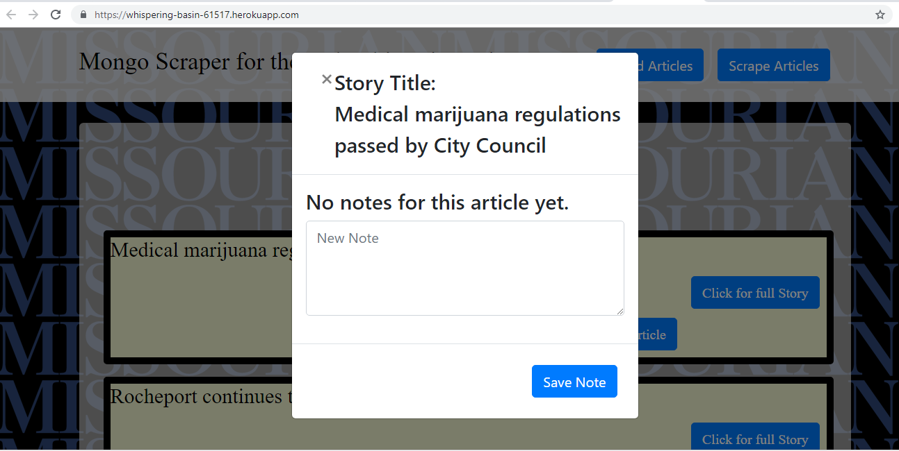

# MongoScraper

In this assignment, I created a web app that lets users view and leave comments on the latest news. This is a full stack app using Mongoose and Cheerio to scrape news from another site.

It used npm programs such as:
* express
* express-handlebars
* mongoose
* cheerio
* axios
It also uses:
* Using Node and Express Web Server;
* Backed by a Mongo Database;
* It has GET and POST routes for retrieving and adding new data;
* It is deployed using Heroku (with Data);

 

 [Link to application](https://whispering-basin-61517.herokuapp.com/)
